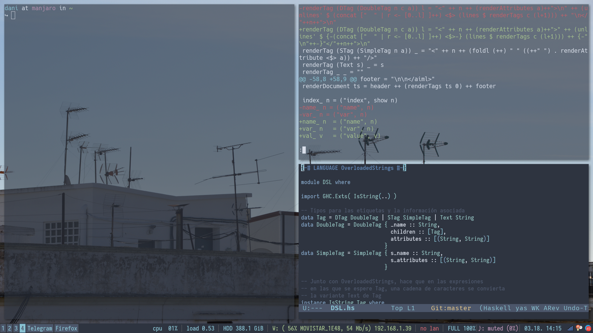

# dotfiles

My dotfiles, managed with GNU Stow. See [this explanation](https://github.com/xero/dotfiles#how-it-works) for details.

## Telegram

A Telegram theme based on [Nord](https://github.com/arcticicestudio/nord) is provided, but must be manually installed (as far as I know).

## Background script

[A script](bg/.fehbg) for setting the background image is provided, the background image is not though. This script is called at startup in the i3 config file.

## i3-gaps

Some custom shortcuts different from default are set in my config.
